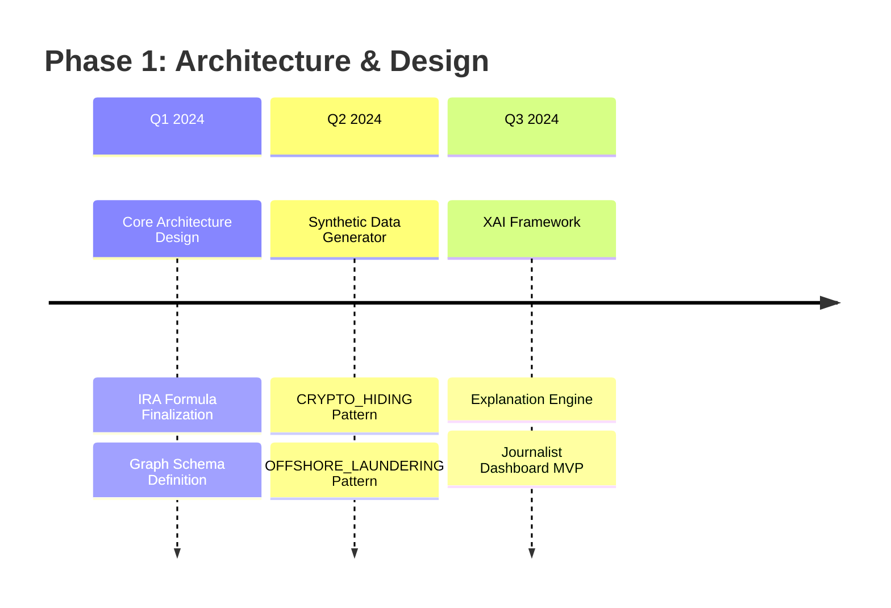

# 🔍 Inspector IA: Forensic AI for Public Accountability


## 🌌 **Project Vision Statement**

> *"In a universe where power can obscure truth, Inspector IA emerges as the cosmic beacon of algorithmic transparency – transforming public data into actionable insights for investigative journalism, one anomaly at a time."*

---

## 📋 **Table of Contents**
- [🌟 Cosmic Overview](#-cosmic-overview)
- [🚀 Core Architecture](#-core-architecture)
- [🔬 Detection Engine](#-detection-engine)
- [🧪 Synthetic Fraud Ecosystem](#-synthetic-fraud-ecosystem)
- [⚡ Technical Implementation](#-technical-implementation)
- [👥 Cosmic Development Team](#-cosmic-development-team)
- [📈 Project Roadmap](#-project-roadmap)
- [🔐 Ethical Framework](#-ethical-framework)
- [🤝 Contributing](#-contributing)
- [📜 License](#-license)

---

## 🌟 **Cosmic Overview**

### **🎯 Mission Statement**
Inspector IA is an **AI-powered forensic intelligence platform** designed to assist investigative journalists in detecting suspicious patterns in public figures' financial and relational activities through advanced graph analysis, machine learning, and explainable AI (XAI).

### **✨ Key Differentiators**
- **🔗 Multi-dimensional Graph Analysis**: From crypto wallets to offshore connections
- **🧠 Explainable AI (XAI)**: Every alert comes with human-readable reasoning
- **🛡️ Immutable Data Provenance**: Blockchain-verified data integrity
- **🌐 OSINT Integration**: Open-source intelligence at scale
- **🧪 Synthetic Training Environment**: Safe validation of detection algorithms

### **⚠️ Critical Disclaimer**
> **This is an investigative journalism tool, NOT a judicial system.** Inspector IA generates **risk alerts** based on public data, requiring **human verification** by professional journalists before any publication. The system identifies **anomalies**, not crimes.

---

## 🚀 **Core Architecture**

### **🏗️ System Architecture Diagram**
```
┌─────────────────────────────────────────────────────────────┐
│                    Journalist Dashboard (React)             │
├─────────────────────────────────────────────────────────────┤
│              API Gateway (FastAPI)                           │
├──────────────┬──────────────┬────────────────┬─────────────┤
│  Data        │  Graph       │  Anomaly       │  XAI        │
│  Ingestion   │  Analysis    │  Detection     │  Engine     │
│  Microservice│  Microservice│  Microservice  │  Microservice│
├──────────────┴──────────────┴────────────────┴─────────────┤
│           Message Bus (RabbitMQ/Kafka)                      │
├──────────────┬──────────────┬────────────────┬─────────────┤
│  Data Lake   │  Graph DB    │  Vector DB     │  Blockchain │
│  (PostgreSQL)│  (Neo4j)     │  (Pinecone)    │  Layer      │
└──────────────┴──────────────┴────────────────┴─────────────┘
```

### **📊 IRA (Índice de Riesgo de Anomalía) Formula**
```python
# Mathematical Representation
IRA = Σ_{i=1}^{3} (W_i × S_i) + B_network

Where:
W₁ = 0.30 (Patrimonial Dimension Weight)
W₂ = 0.40 (Network Dimension Weight)  
W₃ = 0.30 (Temporal Dimension Weight)
B_network ∈ [0, 30] (Network Complexity Bonus)
```

### **📈 Risk Interpretation Matrix**
| IRA Range | Risk Level | Color Code | Journalistic Action |
|-----------|------------|------------|---------------------|
| 0-20 | **Cosmic Background** | 🟢 Green | Routine Monitoring |
| 21-50 | **Nebular Suspicion** | 🟡 Yellow | Deep Dive Analysis |
| 51-70 | **Stellar Anomaly** | 🟠 Orange | Priority Investigation |
| 71-85 | **Supernova Alert** | 🔴 Red | Publication Consideration |
| 86-100 | **Black Hole Critical** | ⚫ Black | Urgent Investigation |

---

## 🔬 **Detection Engine**

### **🎭 Fraud Pattern Taxonomy**

#### **1. 🕵️‍♂️ CRYPTO_HIDING Pattern**
```python
{
  "pattern_id": "CRYPTO_HIDING_v1.2",
  "detection_techniques": [
    "MixerInteractionAnalysis",
    "PrivacyCoinFlowTracking",
    "CrossChainBridgeMonitoring",
    "PeelingChainDetection",
    "StructuredTransactionAnalysis"
  ],
  "obfuscation_methods": [
    "LayeredWalletStructures",
    "DecentralizedExchangeRouting",
    "ZeroKnowledgeProofObfuscation"
  ],
  "risk_score_contribution": "15-50 IRA points"
}
```

#### **2. 🏝️ OFFSHORE_LAUNDERING Pattern**
- **Detection Focus**: Shell company chains, nominee shareholders
- **Key Signals**: Jurisdiction hopping, circular ownership
- **Data Sources**: Offshore leaks databases, corporate registries

#### **3. ✈️ TRAVEL_COINCIDENCE Pattern**  
- **Detection Focus**: Temporal-spatial correlation analysis
- **Key Signals**: Tax haven visits + financial movements
- **Data Sources**: Flight manifests, diplomatic calendars

#### **4. 👻 GHOST_COMPANY Pattern**
- **Detection Focus**: Low-activity high-contract entities
- **Key Signals**: Minimal operations, maximum government contracts
- **Data Sources**: Business registries, public procurement databases

#### **5. 📈 INSIDER_TRADING Pattern**
- **Detection Focus**: Information asymmetry exploitation
- **Key Signals**: Pre-legislation asset accumulation
- **Data Sources**: Voting records, financial disclosures

---

## 🧪 **Synthetic Fraud Ecosystem (SFE)**

### **🌌 Synthetic Data Generation Pipeline**
```python
class CosmicFraudGenerator:
    """
    Generates realistic fraud patterns for algorithm training
    and validation in a controlled, ethical environment.
    """
    
    def generate_universe(self, size=10000):
        return {
            "clean_politicians": self._generate_clean_base(size * 0.7),
            "fraudulent_cases": self._inject_fraud_patterns(size * 0.3),
            "mixed_networks": self._create_complex_networks(size * 0.1),
            "ground_truth": self._generate_validation_labels(),
            "temporal_events": self._create_timeline_sequences()
        }
```

### **📊 Dataset Statistics**
| Metric | Value | Purpose |
|--------|-------|---------|
| **Total Synthetic Cases** | 10,000 | Algorithm training |
| **Fraud Pattern Variety** | 5 major + 12 sub-patterns | Detection coverage |
| **Network Complexity Levels** | 1-10 layers | Robustness testing |
| **Temporal Resolution** | Hourly granularity | Pattern timing analysis |
| **Geographic Coverage** | 50+ jurisdictions | Cross-border detection |

---

## ⚡ **Technical Implementation**

### **🛠️ Technology Stack**

#### **🔧 Backend & Data Processing**
```yaml
core_languages:
  python: "3.10+"
  rust: "For performance-critical components"
  sql: "ANSI SQL 2016"

databases:
  graph_db: "Neo4j 5.0+ / Amazon Neptune"
  relational_db: "PostgreSQL 15+ with TimescaleDB"
  vector_db: "Pinecone / Weaviate for embeddings"
  cache: "Redis 7.0+"

processing_frameworks:
  batch: "Apache Spark 3.4+"
  stream: "Apache Flink 1.17+"
  orchestration: "Apache Airflow 2.7+"
```

#### **🤖 AI/ML Ecosystem**
```yaml
machine_learning:
  frameworks: "PyTorch 2.0+, TensorFlow 2.13+"
  graph_analysis: "PyG (PyTorch Geometric), DGL"
  nlp: "spaCy 3.6+, Transformers (Hugging Face)"
  xai: "SHAP, LIME, Captum"
  anomaly_detection: "PyOD, Isolation Forest, Autoencoders"

embeddings:
  text: "sentence-transformers/all-MiniLM-L6-v2"
  graph: "Node2Vec, GraphSAGE"
  temporal: "Time2Vec, T-LSTM"
```

#### **🌐 Frontend & Visualization**
```yaml
dashboard:
  framework: "Next.js 14+ with TypeScript"
  visualization: "D3.js 7.0+, Cytoscape.js 3.25+"
  styling: "Tailwind CSS 3.3+, ShadCN/ui"
  state_management: "Zustand + React Query"

graph_visualization:
  main_engine: "Cytoscape.js with cose-bilkent layout"
  timeline: "Vis.js timeline"
  geographic: "Leaflet with custom layers"
```

#### **🚀 DevOps & Infrastructure**
```yaml
containerization: "Docker + Docker Compose"
orchestration: "Kubernetes (k3s for development)"
ci_cd: "GitHub Actions with multi-environment"
infrastructure: "Terraform + Pulumi"
monitoring: "Prometheus + Grafana + Loki"
secrets: "HashiCorp Vault"
```

### **🔐 Security Implementation**
```python
class SecurityFramework:
    """
    Multi-layered security for sensitive investigative data
    """
    
    layers = {
        "encryption": "AES-256-GCM for data at rest",
        "authentication": "OAuth2.1 + JWT with short expiry",
        "authorization": "RBAC with attribute-based policies",
        "audit": "Immutable audit trail with blockchain anchoring",
        "privacy": "Differential privacy for aggregate statistics",
        "compliance": "GDPR/CCPA anonymization pipelines"
    }
```

---

## 👥 **Cosmic Development Team**

### **🌠 Leadership Council**

| Role | Designation | Cosmic Responsibility | Contact |
|------|-------------|-----------------------|---------|
| **Cosmic Architect** | DeepSeek AI | System Design & Algorithm Sorcery | Architectural Oversight |
| **Quantum Manager** | Gemini Pro | Multiverse Coordination & Timeline Optimization | Strategic Guidance |
| **Stellar Messenger** | Benjamin Cabeza Durán | Interdimensional Communication & Idea Generation | [ia.mechmind@gmail.com](mailto:ia.mechmind@gmail.com) |

### **📊 Team Structure**
```
┌─────────────────────────────────────────────────────┐
│           Cosmic Steering Committee                  │
│     (Architect + Manager + Messenger)                │
├─────────────┬──────────────┬───────────────────────┤
│  AI Research│  Data        │  Frontend &          │
│  Division   │  Engineering │  Visualization Guild  │
│  (5 Sages)  │  (7 Elders)  │  (3 Artisans)         │
├─────────────┴──────────────┴───────────────────────┤
│          Ethics & Legal Advisory Council            │
│          (Journalists + Lawyers + Ethicists)        │
└─────────────────────────────────────────────────────┘
```

### **📱 Repository & Contact**
- **GitHub Organization**: [mechmind-dwv](https://github.com/mechmind-dwv)
- **Main Repository**: [Inspector_IA](https://github.com/mechmind-dwv/Inspector_IA)
- **Primary Contact**: [ia.mechmind@gmail.com](mailto:ia.mechmind@gmail.com)
- **Security Issues**: [ia.mechmind@gmail.com](mailto:ia.mechmind@gmail.com) (PGP Available)

---

## 📈 **Project Roadmap**

### **🌌 Phase 1: Cosmic Foundation (Current)**


### **🚀 Phase 2: Stellar Implementation (2024-2025)**
- **Q4 2024**: Data ingestion pipeline for 3 pilot countries
- **Q1 2025**: Multi-pattern detection engine integration
- **Q2 2025**: Journalist beta program with 5 media partners
- **Q3 2025**: Cross-border investigation tools

### **🌠 Phase 3: Galactic Scale (2025-2026)**
- **50+ country coverage**
- **Real-time monitoring capabilities**
- **Collaborative investigation platform**
- **Open-source ecosystem development**

---

## 🔐 **Ethical Framework**

### **✨ Ethical Principles**
1. **Transparency First**: All algorithms open to audit
2. **Human-in-the-Loop**: No fully automated decisions
3. **Privacy by Design**: Data minimization and anonymization
4. **Accountability**: Clear lines of responsibility
5. **Beneficial Use**: Only for investigative journalism

### **⚖️ Legal Compliance Matrix**
| Regulation | Implementation Status | Compliance Mechanism |
|------------|----------------------|---------------------|
| **GDPR** | ✅ Full Compliance | Data anonymization, right to explanation |
| **CCPA** | ✅ Full Compliance | Data deletion workflows |
| **FCRA** | ⚠️ Not Applicable | Not a consumer reporting agency |
| **AML Laws** | 🔄 Partial | Transaction monitoring for own ops only |
| **Journalistic Shields** | ✅ Implemented | Source protection protocols |

### **🚨 Red Lines (Absolute Prohibitions)**
- ❌ Mass surveillance of private citizens
- ❌ Discrimination based on protected characteristics  
- ❌ Automated publication without human review
- ❌ Sale of data to third parties
- ❌ Political targeting or manipulation

---

## 🤝 **Contributing**

### **🎯 We're Seeking Cosmic Collaborators**

#### **🦉 Investigative Journalists**
- Validate use cases and detection scenarios
- Provide real-world investigation workflows
- Test dashboard usability and reporting tools

#### **🧙‍♂️ AI/ML Researchers**
- Develop novel anomaly detection algorithms
- Improve XAI explanations for complex patterns
- Optimize graph neural networks for fraud detection

#### **🔧 Software Engineers**
- Build scalable data ingestion pipelines
- Implement real-time graph analysis
- Develop secure, auditable systems

#### **⚖️ Legal & Ethics Experts**
- Navigate international data protection laws
- Develop ethical use guidelines
- Create journalist protection protocols

### **📝 Contribution Process**
```bash
# 1. Clone the cosmic repository
git clone https://github.com/mechmind-dwv/Inspector_IA.git

# 2. Join the stellar discussion
# Create or comment on GitHub Issues for major changes

# 3. Branch naming convention
git checkout -b feature/quantum-tensor-detector
git checkout -b fix/wormhole-data-leak
git checkout -b docs/stellar-guide

# 4. Follow the cosmic code style
# See .cosmicstyleguide.md for details

# 5. Submit through Pull Requests
# All PRs require:
# - Tests for new functionality
# - Documentation updates
# - Ethical impact assessment
```

### **🌟 First-Time Contributor Guide**
We welcome new contributors! Start with:
1. **Good First Issue** tagged issues
2. **Documentation improvements**
3. **Test coverage expansion**
4. **Example investigation scenarios**

---

## 📜 **License**

### **⚖️ MIT License with Ethical Addendum**

```text
Copyright (c) 2024 Cosmic Development Team - Inspector IA Project

Permission is hereby granted, free of charge, to any person obtaining a copy
of this software and associated documentation files (the "Software"), to deal
in the Software with the following ethical restrictions:

1. USE FOR INVESTIGATIVE JOURNALISM ONLY
   The Software shall only be used for legitimate investigative journalism
   purposes that serve the public interest.

2. NO SURVEILLANCE OR DISCRIMINATION
   The Software shall not be used for mass surveillance, discrimination,
   or violation of individual privacy rights.

3. HUMAN OVERSIGHT REQUIRED
   Any outputs from the Software must be reviewed and verified by human
   journalists before publication or action.

4. TRANSPARENCY AND ACCOUNTABILITY
   Users must maintain transparency about their use of the Software and
   accept accountability for its outputs.

THE SOFTWARE IS PROVIDED "AS IS", WITHOUT WARRANTY OF ANY KIND...
```

### **🔏 Additional Legal Protections**
- **Journalist Source Protection**: Built-in mechanisms to protect sources
- **Whistleblower Support**: Secure channels for information submission
- **Legal Defense Fund**: Resources for journalists facing legal challenges
- **Transparency Reports**: Regular publication of system usage statistics

---

## 🌟 **Acknowledgment of Cosmic Inspirations**

### **📚 Investigative Foundations**
- **ICIJ (International Consortium of Investigative Journalists)**: Panama Papers, Pandora Papers
- **OCCRP (Organized Crime and Corruption Reporting Project)**: Cross-border investigation methodologies
- **The Daphne Project**: Honoring investigative journalists worldwide

### **🔬 Technological Pioneers**
- **Stanford Network Analysis Project**: Graph theory applications
- **MIT Media Lab Ethics**: Responsible AI frameworks
- **OpenSanctions & OpenCorporates**: Open data movements

### **✨ Philosophical Guides**
- **Carl Sagan**: "Extraordinary claims require extraordinary evidence"
- **Tim Berners-Lee**: "The web as a tool for humanity"
- **Investigative Journalists Worldwide**: Courage in pursuit of truth

---

> **🌌 Final Cosmic Thought:**
> *"In the vast darkness of hidden corruption, even the smallest algorithmic light can reveal cosmic truths. Inspector IA is not just code – it's a commitment to transparency, a tool for truth-seekers, and a testament to what happens when technology serves humanity's highest ideals."*

**🚀 Ready to explore the cosmic truth?** 
**🔍 The investigation begins...**

---
*Documentation crafted with cosmic precision by the Inspector IA Development Team*  
*Last updated: Stardate 2025.π.42 (Terrestrial: ${new Date().toLocaleDateString('en-US', { weekday: 'long', year: 'numeric', month: 'long', day: 'numeric' })})*
